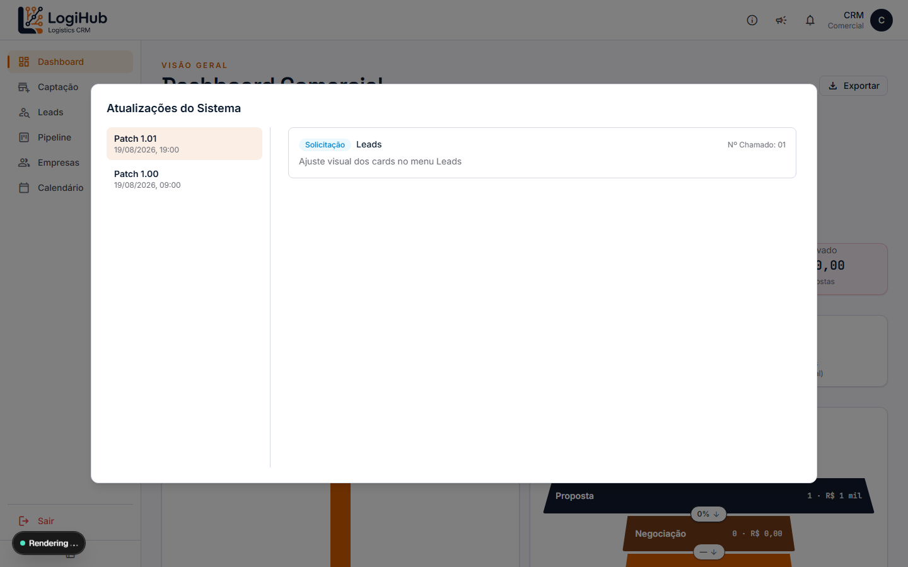
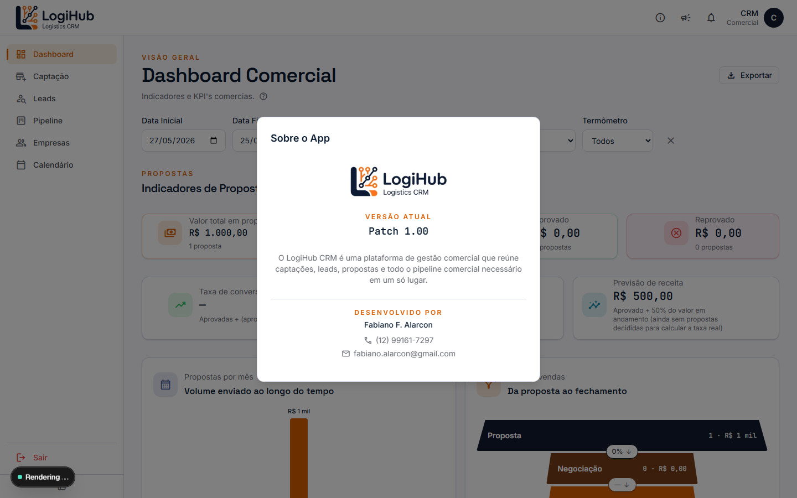
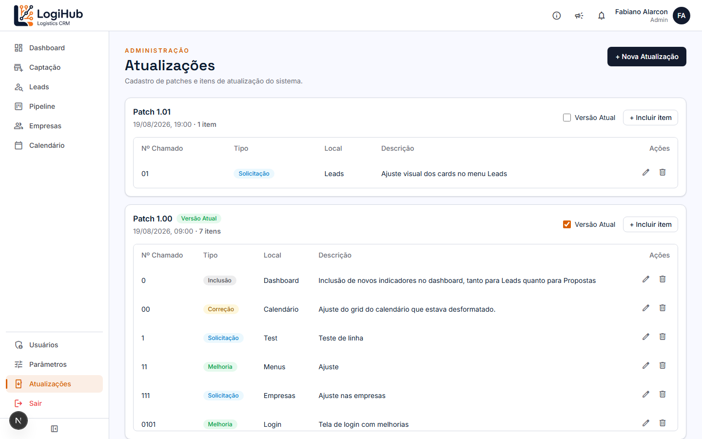

# Manual do usuário: Atualizações

> Não é uma funcionalidade de negócio do CRM: é o **changelog do próprio sistema**, um jeito de o Admin documentar o que mudou em cada versão, e todo mundo saber o que está rodando.

## Para qualquer usuário: ver as novidades

Clique no ícone de megafone (📢) no cabeçalho, em qualquer tela:

À esquerda ficam os patches (versões), do mais recente pro mais antigo; clicando num patch, os itens de mudança dele aparecem à direita, cada um com um tipo (Solicitação/Correção/Melhoria/Inclusão), o local do sistema afetado, a descrição, e opcionalmente o número de um chamado de suporte relacionado.

O ícone de informação (ℹ️) ao lado abre **Sobre o App**, mostrando a versão atualmente em produção e contato do desenvolvedor:

## Para o Admin: gerenciar patches

Menu lateral **Atualizações** (só aparece pra Admin):

- **+ Nova Atualização**: cria um patch novo (só pede o número/nome do patch e a data/hora).
- **+ Incluir item**: dentro de um patch, adiciona uma linha de mudança (nº do chamado opcional, tipo, local, descrição).
- **✏️ / 🗑️**: editar ou excluir um item específico (o patch em si não tem edição/exclusão depois de criado, só os itens dentro dele).
- **Versão Atual**: o checkbox ao lado de cada patch marca qual é a versão oficialmente em produção agora (só um patch pode estar marcado por vez; marcar um novo desmarca o anterior automaticamente). É esse valor que aparece no "Sobre o App" pra todo mundo.

## Quem pode fazer o quê

- **Qualquer usuário**: ver os patches e itens, ver a versão atual.
- **Só Admin**: criar patch, incluir/editar/excluir item, marcar a versão atual.
