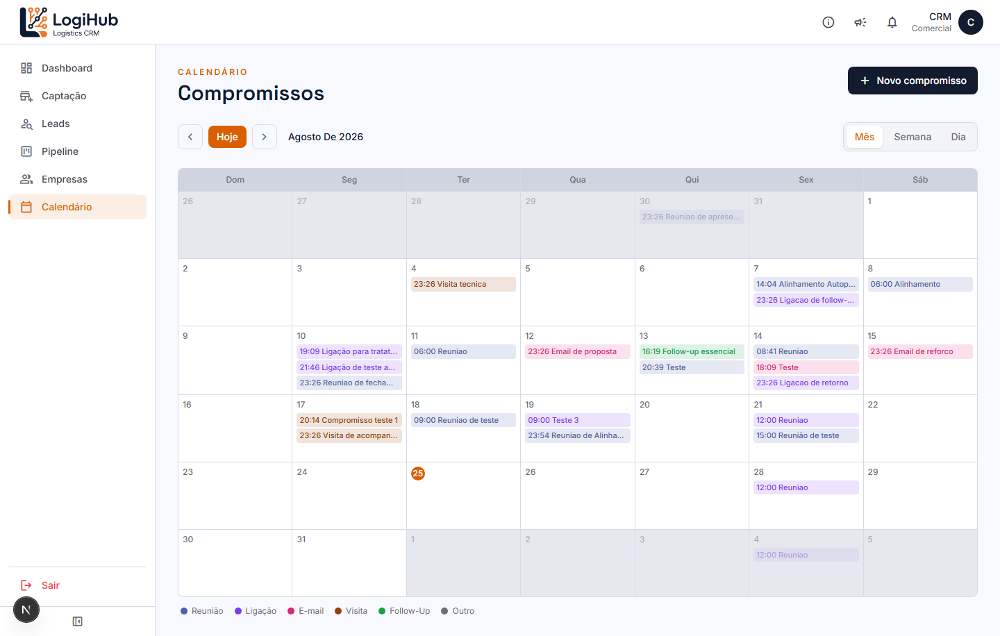
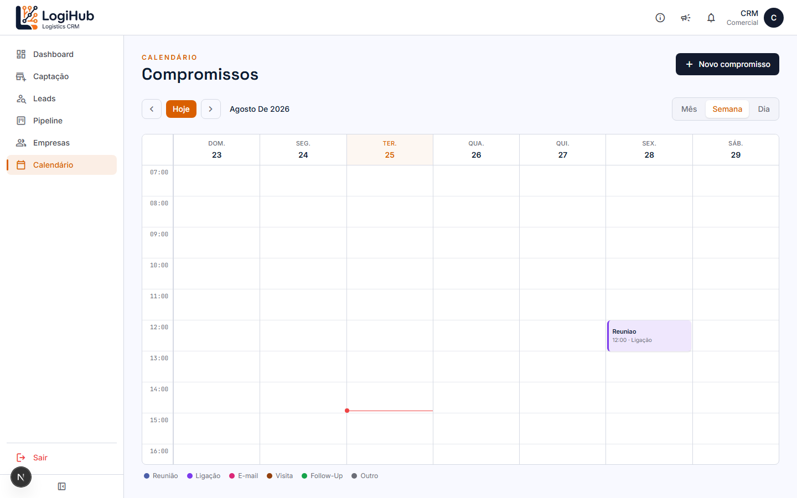
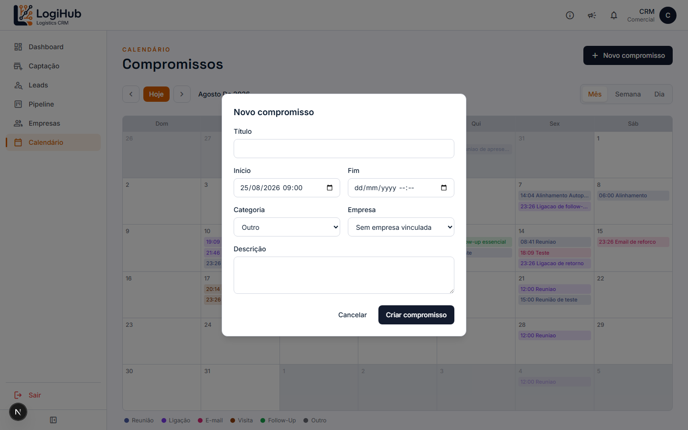
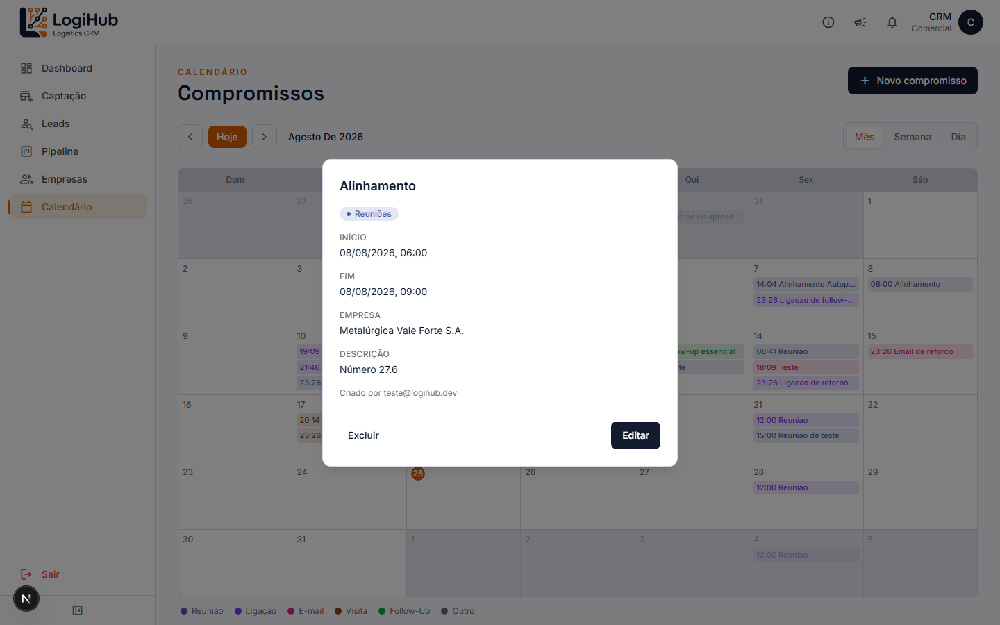

# Manual do usuário — Calendário

> Acesso: menu lateral **Calendário**. Disponível para todos os usuários (Admin e Comercial) — a agenda é **compartilhada**: todo mundo vê os compromissos de todo mundo, não é uma agenda individual.

## Visão mensal

Cada compromisso aparece como um chip colorido no dia, com horário e título. A cor indica a **categoria** (legenda no rodapé): Reunião, Ligação, E-mail, Visita, Follow-Up ou Outro. Use as setas **‹ ›** ou o botão **Hoje** pra navegar entre os meses.

## Visões semanal e diária

Alterne entre **Mês / Semana / Dia** no canto superior direito:

Nessas visões, os compromissos aparecem numa grade por horário (não só uma lista) — a posição e a altura do bloco refletem o horário real de início/fim. A linha vermelha marca a hora atual.

## Como criar um compromisso

Clique em **+ Novo compromisso** (ou diretamente num dia vazio, na visão de mês):

| Campo | Obrigatório? |
|---|---|
| Título | Sim |
| Início | Sim |
| Fim | Não |
| Categoria | Sim (Reunião/Ligação/E-mail/Visita/Follow-Up/Outro) |
| Empresa | Não |
| Descrição | Não |

> Repetição/recorrência (ex: "toda semana") só está disponível quando o compromisso é criado como uma **Ação dentro de um Lead** (veja o [manual de Leads](leads.md)) — criando por aqui, é sempre um compromisso único.

## Como ver/editar/excluir um compromisso

Clique em qualquer compromisso pra abrir o detalhe:

Mostra quem criou, horário, empresa vinculada e descrição. **Editar** abre o mesmo formulário de criação com os dados preenchidos; **Excluir** remove o compromisso (com confirmação).

> Se a sincronização com Google Calendar estiver ativa (configurável em **Parâmetros**, só Admin), o compromisso também é criado/atualizado/removido na agenda do Google do responsável automaticamente.

## Quem pode fazer o quê

Não tem restrição por perfil — **qualquer usuário autenticado** pode ver, criar, editar e excluir qualquer compromisso, de qualquer pessoa. É uma agenda de equipe, não individual.
