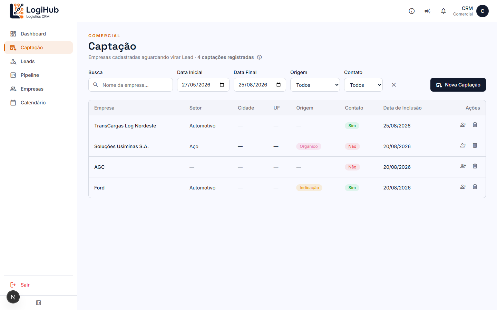
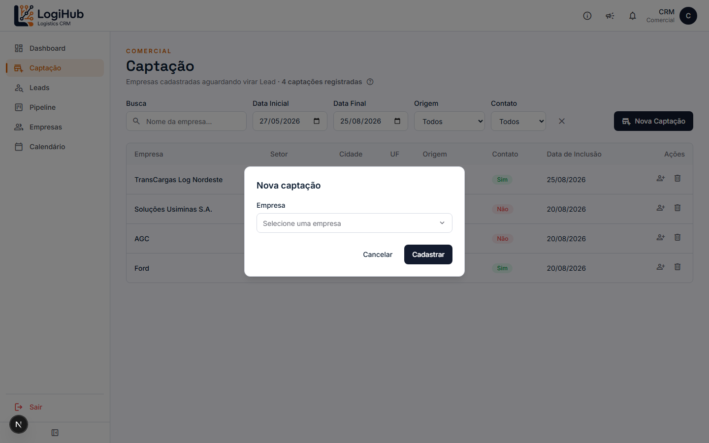
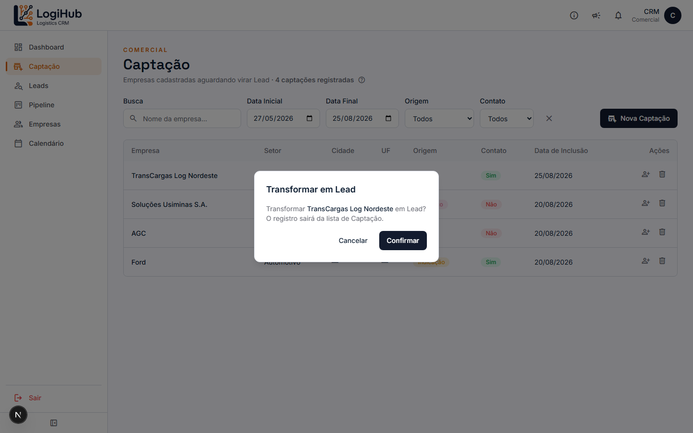

# Manual do usuário — Captação

> Acesso: menu lateral **Captação**. Disponível para todos os usuários (Admin e Comercial).

A Captação é a "caixa de entrada" de empresas recém-cadastradas que ainda não viraram um Lead — um lembrete de "essa empresa entrou no sistema, mas ninguém falou com ela ainda comercialmente". Não é uma etapa obrigatória: dá pra criar um Lead direto (veja o [manual de Leads](leads.md)) sem passar por aqui.

## Visão geral

Cada linha é uma empresa aguardando qualificação. As colunas mostram: setor, cidade/UF, **origem do lead** (como a empresa chegou até vocês — indicação, orgânico, etc.), se ela já tem algum **contato registrado**, e a data em que entrou na lista.

Por padrão, a lista mostra só os **últimos 90 dias** — use os filtros de data pra ver captações mais antigas.

## Como filtrar

Busca por nome da empresa, período (Data Inicial/Final), Origem e se já tem Contato (Sim/Não). O botão **✕** limpa tudo de uma vez.

## Como criar uma captação

Clique em **+ Nova Captação** e escolha a empresa já cadastrada:

> A empresa precisa já existir em **Empresas** antes — se ela ainda não foi cadastrada, cadastre lá primeiro. Se preferir, ao criar uma empresa nova o sistema já pergunta se você quer gerar a captação na hora (veja o [manual de Empresas](empresas.md)).

## Como transformar em Lead

Clique no ícone de "adicionar pessoa" (👤+) na linha da empresa:

Confirmando, o sistema:
- Cria um Lead novo pra essa empresa, já no estágio inicial (Prospecção).
- Remove a empresa da lista de Captação (o registro "vira" o Lead, não fica duplicado).

O Lead criado aparece em **Leads**, pronto pra ser trabalhado.

## Como excluir uma captação

Clique no ícone de lixeira na linha e confirme — remove o registro sem criar nenhum Lead. **Não fica registrada no log de auditoria** (diferente da exclusão de Proposta/Lead/Empresa) — não tem como recuperar depois de excluído.

## Quem pode fazer o quê

Não é uma tela administrativa — **qualquer usuário autenticado** pode ver, criar, excluir e transformar uma captação em Lead. Não existe um passo de edição (o único dado é a empresa vinculada; se estiver errado, exclua e crie de novo).
