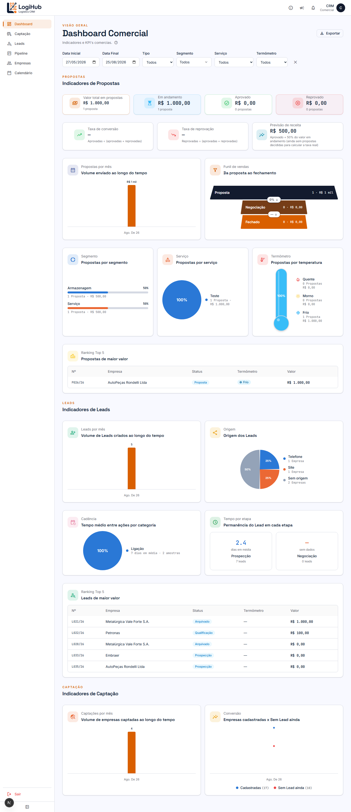

# Manual do usuário: Dashboard

> Acesso: menu lateral **Dashboard** (também é a página inicial do sistema). Disponível para todos os usuários (Admin e Comercial).

Painel de indicadores comerciais que reúne numa tela só o que antes vivia espalhado numa planilha. Cobre as 3 frentes do funil: Propostas, Leads e Captação.

## Como filtrar

No topo: **Data Inicial**/**Data Final** (padrão: últimos 90 dias), **Tipo** (Fixo/Spot), **Segmento**, **Serviço** e **Termômetro**. Todos os gráficos e KPIs da tela reagem ao filtro escolhido. O botão **✕** limpa tudo de uma vez, e **Exportar** (canto superior direito) baixa os dados filtrados.

## Indicadores de Propostas

- **KPIs do topo**: valor total em propostas, valor em andamento, valor aprovado e valor reprovado (com a contagem de propostas em cada).
- **Taxa de conversão** e **Taxa de reprovação**: aprovadas ÷ (aprovadas + reprovadas), e o mesmo pro reprovado.
- **Previsão de receita**: valor já aprovado + uma estimativa sobre o que está em andamento (usando a taxa de conversão histórica; cai pra 50% enquanto não há propostas decididas o bastante pra confiar na taxa real, isso fica explicado na própria legenda do card).
- **Propostas por mês**: volume (em R$) enviado ao longo do tempo.
- **Funil de vendas**: quantas propostas estão em cada estágio (Proposta → Negociação → Fechado) e a taxa de conversão entre eles.
- **Propostas por segmento** / **por serviço** / **por temperatura (Termômetro)**: distribuição em barras, pizza e um "termômetro" visual.
- **Ranking Top 5**: as 5 propostas de maior valor no período filtrado.

## Indicadores de Leads

Mesma lógica, mas olhando pro funil inicial (veja o [manual de Leads](leads.md)):

- **Leads por mês**: volume de Leads criados ao longo do tempo.
- **Origem dos Leads**: de onde vieram (telefone, site, indicação, sem origem registrada, etc.), como fatia de pizza.
- **Cadência**: tempo médio entre Ações registradas, por categoria (ex: a cada quantos dias em média se faz uma ligação de follow-up).
- **Tempo por etapa**: quantos dias, em média, um Lead fica parado em cada estágio (Prospecção, Qualificação) antes de avançar.
- **Ranking Top 5**: os 5 Leads de maior valor estimado.

## Indicadores de Captação

- **Captações por mês**: quantas empresas novas entraram na fila de Captação.
- **Empresas cadastradas × Sem Lead ainda**: cruza todas as empresas já cadastradas com quantas delas ainda não têm nenhum Lead, mostrando a taxa de conversão real de "virou cliente em prospecção" ao longo do tempo (veja o [manual de Captação](captacao.md)).

## Quem pode fazer o quê

O Dashboard é **somente leitura** para todo mundo: não tem edição aqui, só visualização, filtro e exportação. Os números refletem exatamente o que está cadastrado em Propostas, Leads, Empresas e Captação.
