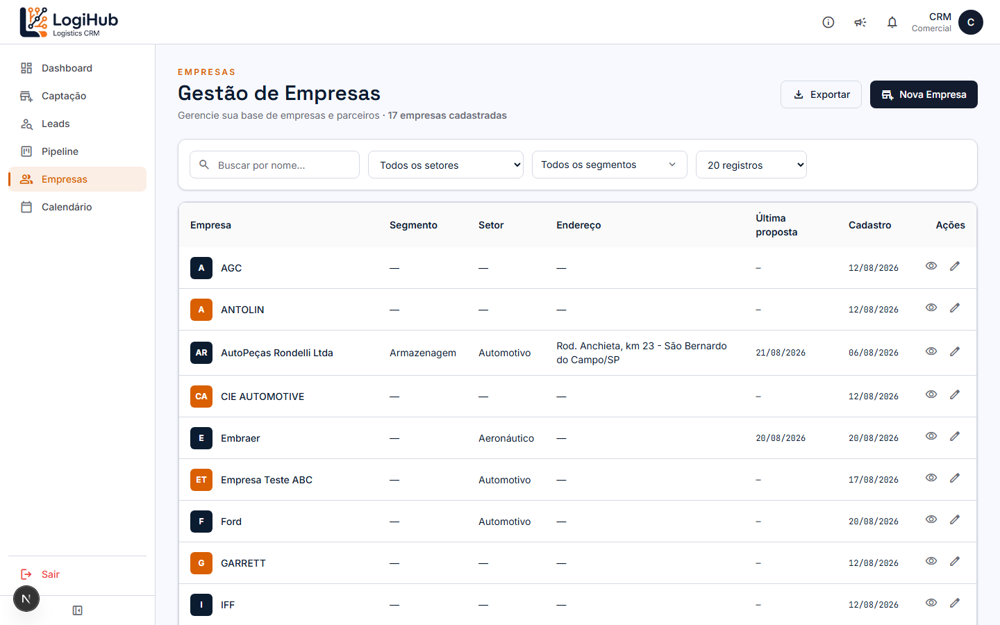
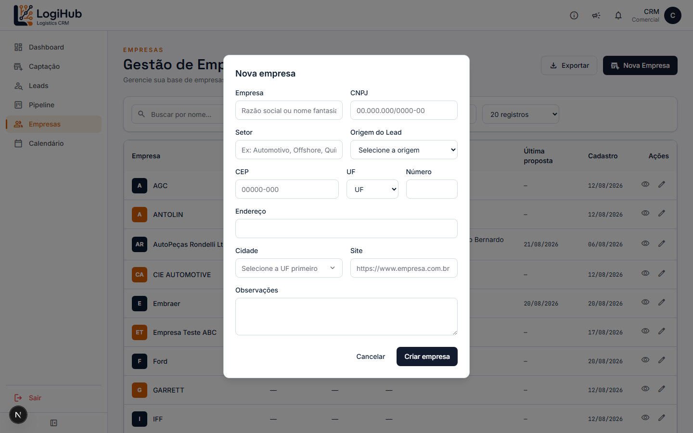
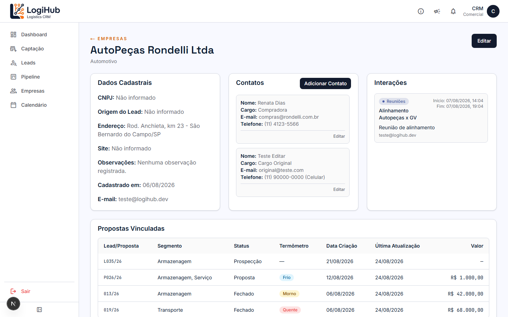

# Manual do usuário — Empresas

> Acesso: menu lateral **Empresas**. Disponível para todos os usuários (Admin e Comercial).

Cadastro de empresas clientes/parceiras — é a base de tudo: toda Captação, Lead, Proposta e Compromisso está ligado a uma Empresa.

## Visão geral

A lista mostra nome, segmento, setor, endereço, data da última proposta e data de cadastro. Use a busca por nome, os filtros de Setor/Segmento, e o seletor de quantos registros mostrar por página.

O botão **Exportar** gera um CSV com os dados filtrados na hora (útil pra abrir no Excel).

## Como cadastrar uma empresa nova

Clique em **+ Nova Empresa**:

Só o **nome da empresa** é obrigatório — o resto (CNPJ, setor, origem do lead, endereço por CEP, site, observações) pode ser preenchido depois. O campo **Origem do Lead** ajuda a rastrear como esse cliente chegou até vocês (indicação, orgânico, etc.) — aparece depois nos indicadores de Captação do Dashboard.

> Depois de criar, o sistema pergunta se você quer gerar uma [Captação](captacao.md) pra essa empresa na hora — útil se ela ainda não teve nenhum contato comercial.

## Detalhe da empresa

Clique no ícone de olho (👁) na linha da empresa:

A página reúne tudo relacionado à empresa, em 4 blocos:

- **Dados Cadastrais** — CNPJ, origem do lead, endereço, site, observações, data de cadastro.
- **Contatos** — pessoas de contato na empresa (nome, cargo, e-mail, telefone). Clique em **Adicionar Contato** pra cadastrar mais um, ou **Editar** num contato existente.
- **Interações** — histórico de reuniões/ligações/e-mails com a empresa (tipo + descrição + data).
- **Propostas Vinculadas** — todos os Leads e Propostas dessa empresa, com status, termômetro e valor — clique em qualquer linha pra ir direto ao [Pipeline](pipeline.md) ou [Leads](leads.md).

Use o botão **Editar** no canto superior direito pra alterar os dados cadastrais.

## Como excluir uma empresa

A exclusão fica disponível no formulário de edição, e é **restrita a Admin** — se você é Comercial, não vai ver essa opção.

## Quem pode fazer o quê

- **Qualquer usuário**: ver, buscar, filtrar, exportar, cadastrar, editar, adicionar contato/interação.
- **Só Admin**: excluir uma empresa.
