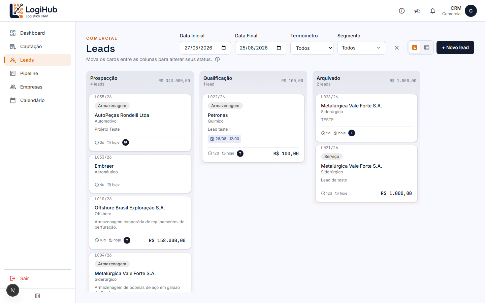
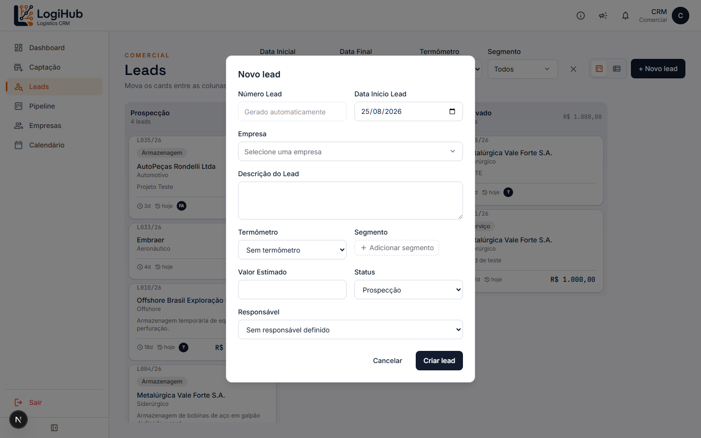
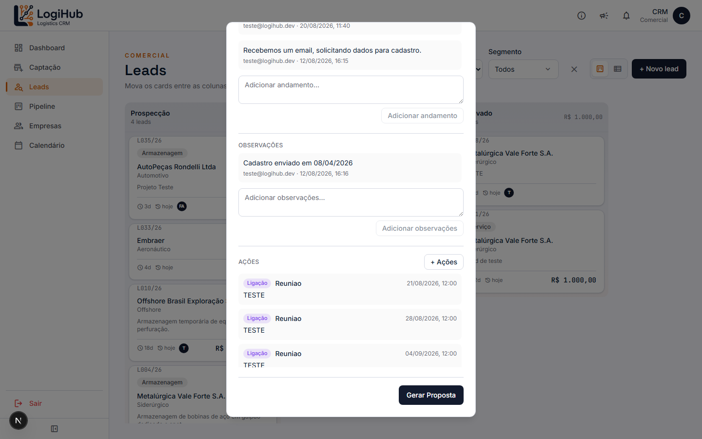
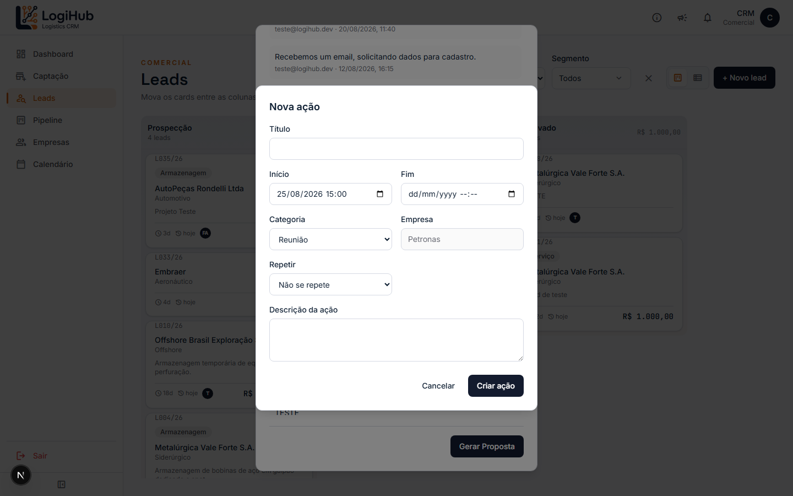

# Manual do usuário — Leads

> Acesso: menu lateral **Leads**. Disponível para todos os usuários (Admin e Comercial).

Leads é o funil inicial da venda — antes de virar uma **Proposta** numerada no [Pipeline](pipeline.md). Tecnicamente é a mesma tabela de Propostas, só num estágio anterior; por isso o quadro se parece muito com o do Pipeline.

## Visão geral do quadro

| Coluna | O que significa |
|---|---|
| **Prospecção** | Primeiro contato, ainda entendendo se há oportunidade real |
| **Qualificação** | Já confirmado que há interesse/fit — pronto pra virar Proposta a qualquer momento |
| **Arquivado** | Lead pausado/perdido, mas não excluído — pode ser reativado depois |

Cada Lead tem um número próprio no formato `L0NN/AA` (ex: `L022/26`) — numeração separada da Proposta, pra rastrear a origem mesmo depois de promovido.

Filtros (Data Inicial/Final, Termômetro, Segmento) e visão em Lista funcionam igual ao Pipeline.

## Como criar um Lead

Clique em **+ Novo lead**:

Diferente da Proposta, o Lead não exige valor, termômetro nem serviço — só a **Empresa** é obrigatória. Preencha o resto conforme for descobrindo mais sobre a oportunidade.

## Detalhe do Lead: andamento, observações e Ações

Clique em qualquer card pra abrir o detalhe. Além dos campos editáveis (mesmo padrão do Pipeline), a parte de baixo do modal tem 3 seções:

- **Andamento** — histórico livre de anotações da negociação (mesma ideia do Pipeline).
- **Observações** — outro histórico, separado do Andamento, pra anotações de outra natureza (ex: dados de cadastro, condições combinadas).
- **Ações** — compromissos (reuniões, ligações, etc.) vinculados a esse Lead específico. Clique em **+ Ações** pra registrar uma nova:

Dá pra fazer a Ação se repetir (**Repetir**: diária, semanal, mensal, anual, ou só dias úteis) — o sistema cria uma Ação pra cada ocorrência automaticamente. Toda Ação criada aqui também aparece no [Calendário](calendario.md), e se a sincronização com Google Calendar estiver ativa (configurável em Parâmetros), entra na agenda do responsável também.

## Como arquivar / reativar um Lead

No detalhe do Lead (visível só pra Admin), há um botão pra **Arquivar** — o Lead sai do fluxo ativo, mas o estágio anterior fica guardado, então **Reativar** devolve ele pro mesmo lugar de onde saiu. Um Lead arquivado não pode ser movido arrastando o card — só pelos botões, pra garantir que a informação de "de onde ele veio" não se perca.

> Se um Lead arquivado ficar muito tempo parado, o sistema cria automaticamente uma Ação de retomada (ex: "Retomada comercial com um Lead arquivado") depois de X dias — configurável em **Parâmetros**.

## Como promover um Lead a Proposta

Quando o Lead está em **Qualificação**, aparece o botão **Gerar Proposta** no rodapé do detalhe (visível pra qualquer usuário, não só Admin). Ao confirmar:

- O mesmo registro vira uma Proposta formal, ganhando um `numero_proposta` (padrão `NNN/AA`).
- Ele passa a aparecer no [Pipeline](pipeline.md) em vez de em Leads.
- O número do Lead original (`L0NN/AA`) continua guardado, então dá pra rastrear de qual Lead essa Proposta veio.

Se precisar desfazer, no Pipeline existe a opção **Reverter para Qualificação** direto no detalhe da Proposta — ela volta a aparecer em Leads.

## Quem pode fazer o quê

- **Qualquer usuário**: ver, criar, editar, registrar Andamento/Observações/Ações, gerar Proposta.
- **Só Admin**: arquivar, reativar e excluir um Lead.
