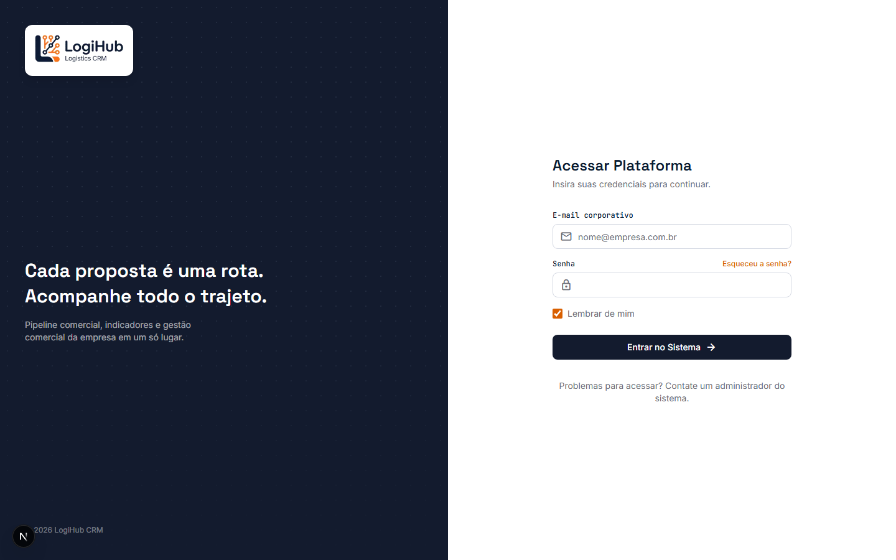
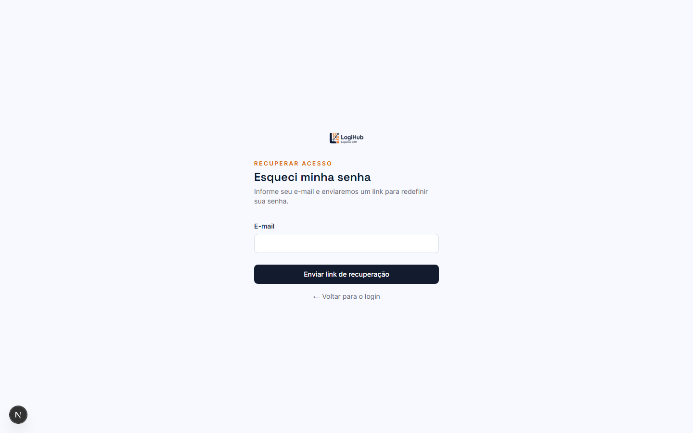

# Manual do usuário — Login e recuperação de senha

## Login

Acesse com o e-mail e a senha cadastrados pelo Admin (veja o [manual de Usuários](usuarios.md)). Se for seu primeiro acesso, a senha informada é **provisória** — o sistema vai pedir pra você definir uma senha nova antes de liberar o resto do sistema.

Se sua conta estiver marcada como **inativa** pelo Admin, o login é bloqueado e aparece um aviso — nesse caso, fale com um administrador do sistema.

## Esqueci minha senha

Clique em **Esqueceu a senha?** na tela de login:

Informe seu e-mail e clique em **Enviar link de recuperação**. Por segurança, a mensagem de confirmação é sempre a mesma, esteja o e-mail cadastrado no sistema ou não — assim ninguém consegue "descobrir" quais e-mails têm conta só tentando recuperar senha.

Se o e-mail estiver cadastrado, chega uma mensagem com um link — clicando nele, você cai numa tela pra definir a nova senha. O link expira depois de um tempo; se isso acontecer, basta repetir o processo.

## Quem pode fazer o quê

Login e recuperação de senha são as únicas telas do sistema acessíveis **sem estar autenticado** — todo o resto do CRM exige login.
