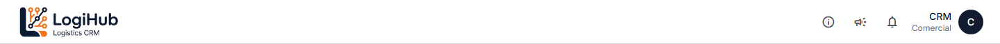
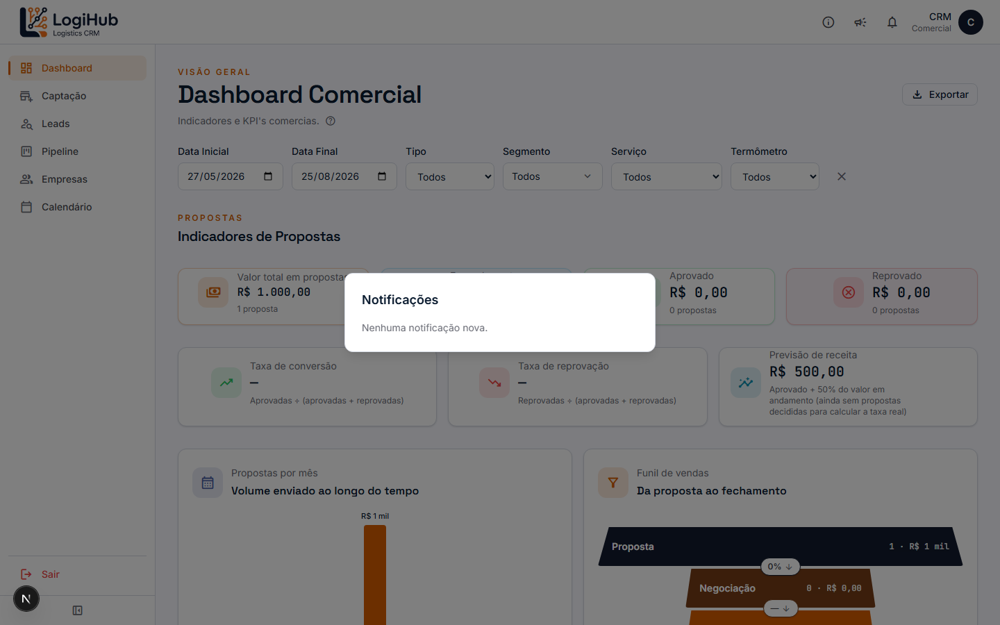

# Manual do usuário: Notificações

> Acesso: ícone de sino (🔔) no canto superior direito, em **qualquer tela** do sistema. Disponível para todos os usuários.

O sino avisa sobre eventos que acontecem no sistema, sem precisar ficar checando cada tela manualmente.

## O que gera uma notificação

- Uma **empresa nova** é cadastrada.
- Um **Lead novo** é criado, ou uma **Proposta nova** é criada/gerada a partir de um Lead.
- Um **card muda de coluna** no Pipeline (movimentação de status).
- Uma **Proposta é aprovada ou reprovada**.
- Uma **Ação nova** é agendada no Calendário.
- Diariamente, o sistema também avisa sobre **itens "esquecidos"**: Lead ou Proposta sem movimentação há muitos dias, Lead ou Proposta sem nenhuma Ação registrada, Empresa cadastrada sem nenhum contato. Os limites de dias pra considerar "esquecido" são configuráveis em **Parâmetros** (Admin).

## Como ver e marcar como lida

Clique no sino pra abrir a lista:

Uma bolinha colorida no ícone do sino indica que há notificação não lida. Clicar numa notificação específica marca só ela como lida; tem também um botão pra marcar todas as visíveis de uma vez. O sino verifica novidades automaticamente a cada 30 segundos, sem precisar recarregar a página.

## Notificação por e-mail

Além do sino, os mesmos eventos podem gerar um **e-mail**. Isso é configurado pelo Admin em **Parâmetros** (liga/desliga geral, quais tipos de evento disparam e-mail, e um "modo teste" que redireciona tudo pra um único e-mail de teste em vez dos usuários reais). Cada usuário também pode desativar o recebimento de e-mail individualmente na sua conta, mesmo com o sistema habilitado.

## Quem pode fazer o quê

Ver/marcar como lida é para **qualquer usuário**: cada um só marca como lida pra si mesmo (a notificação continua aparecendo pros outros até eles também lerem). Configurar o que gera notificação e o comportamento do e-mail é **só Admin**, em [Parâmetros](parametros.md).
