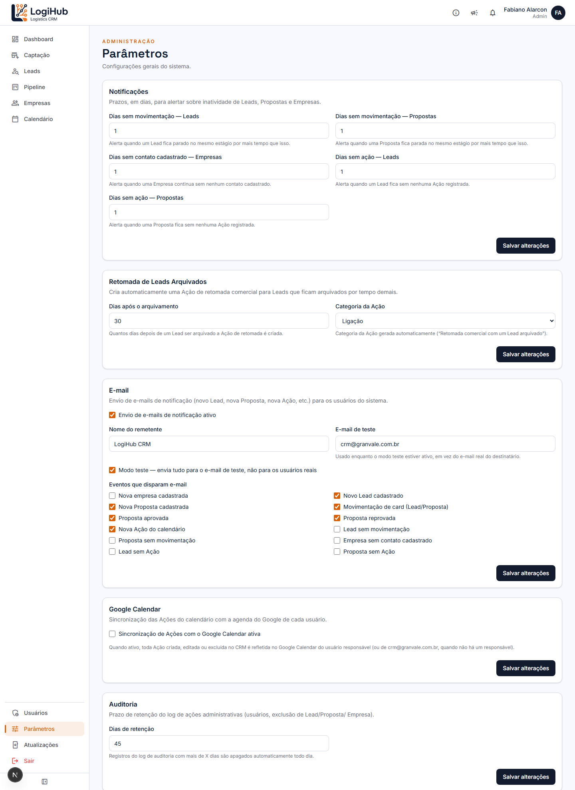

# Manual do usuário: Parâmetros

> Acesso: menu lateral **Parâmetros** (só Admin). Configurações gerais do sistema: mudanças aqui afetam o comportamento pra **todos** os usuários.

Cada seção é independente, com seu próprio botão **Salvar alterações**; mudar uma não afeta as outras.

## Notificações

Define, em dias, quanto tempo sem atividade é considerado "esquecido" antes do sistema avisar (veja o [manual de Notificações](notificacoes.md)):

- **Dias sem movimentação: Leads / Propostas**: quanto tempo parado no mesmo estágio.
- **Dias sem contato cadastrado: Empresas**: empresa cadastrada sem nenhum contato registrado.
- **Dias sem ação: Leads / Propostas**: sem nenhum compromisso (Ação) registrado.

## Retomada de Leads Arquivados

Depois de quantos dias um Lead arquivado ganha automaticamente uma nova Ação de retomada comercial (ex: "Retomada comercial com um Lead arquivado"), e em qual categoria essa Ação entra (Ligação, Reunião, etc.). Veja o [manual de Leads](leads.md#como-arquivar--reativar-um-lead).

## E-mail

Controla o envio de e-mail pros eventos de notificação:

- **Envio de e-mails de notificação ativo**: liga/desliga geral.
- **Nome do remetente**: como aparece no "De:" do e-mail.
- **Modo teste**: enquanto ativo, **todo** e-mail vai só pro endereço configurado em **E-mail de teste**, nunca pros usuários reais. É a proteção padrão pra não disparar e-mail de verdade sem querer enquanto o sistema ainda está sendo ajustado. **Desligue com cuidado**, e só quando tiver certeza de que os dados/usuários cadastrados são reais.
- **Eventos que disparam e-mail**: checklist de quais tipos de notificação viram e-mail (independente do que aparece no sino, que sempre mostra tudo).

## Google Calendar

Um único interruptor: liga ou desliga a sincronização de Ações (compromissos) com o Google Calendar de cada usuário. Quando ativo, toda Ação criada/editada/excluída no CRM é refletida na agenda do Google do responsável (ou de `crm@granvale.com.br`, quando a Ação não tem responsável definido).

> Só funciona de verdade pra usuários com e-mail dentro do Workspace `granvale.com.br` **e** com a sincronização habilitada individualmente (checkbox em [Usuários](usuarios.md)). Ligar aqui não sincroniza sozinho quem não tiver essa segunda opção marcada.

## Auditoria

Quantos dias o log de ações administrativas fica guardado antes de ser apagado automaticamente. O log em si (convites/edições/exclusões de usuário, exclusão de Lead/Proposta/Empresa) não tem uma tela própria de consulta no sistema; fica só guardado pra investigação pontual, se precisar.

## Quem pode fazer o quê

Toda a tela é **exclusiva de Admin**, com checagem tanto na página quanto em cada ação de salvar (não é só a tela escondida pra Comercial).
