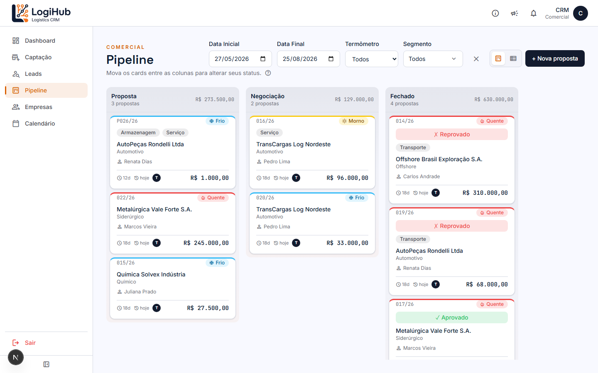
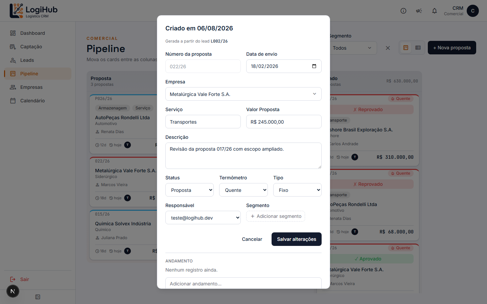
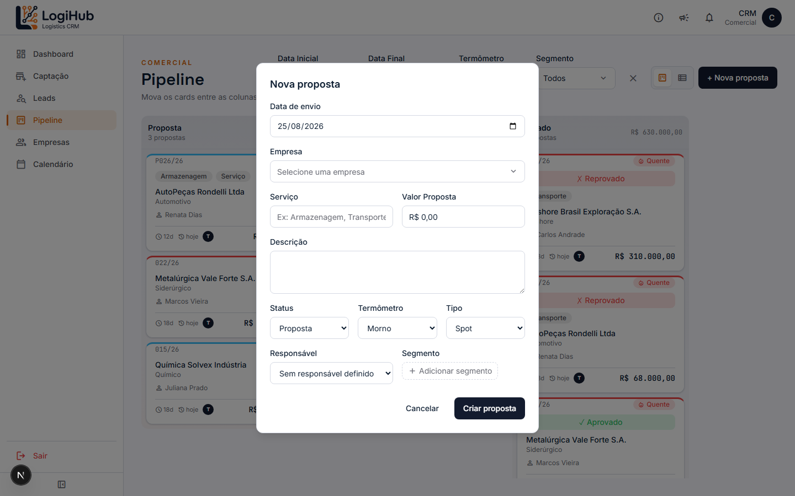
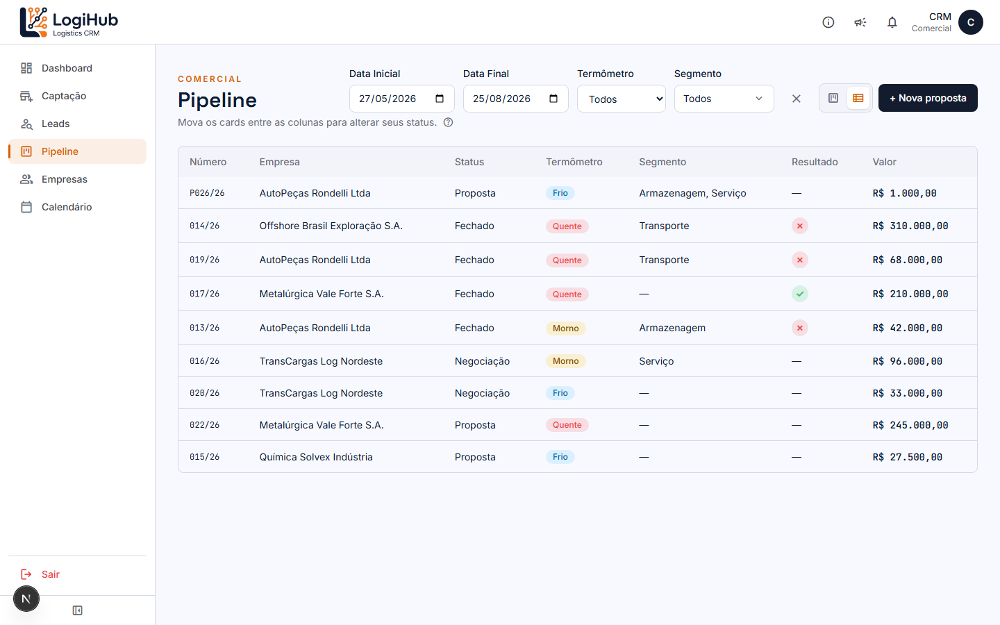
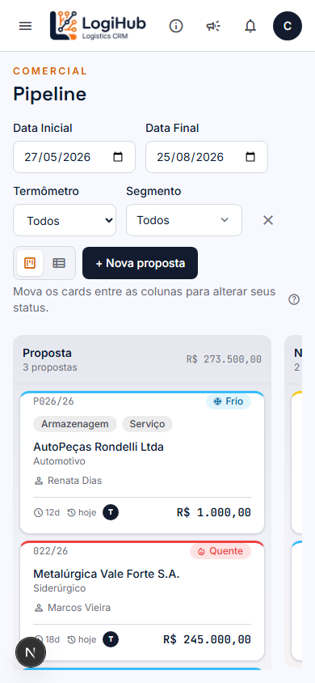

# Manual do usuário: Pipeline

> Acesso: menu lateral **Pipeline**. Disponível para todos os usuários (Admin e Comercial).

O Pipeline é o quadro Kanban onde ficam as **Propostas**: negócios que já saíram da fase de Lead e têm um número formal (`NNN/AA`, ex: `022/26`). Se você está procurando a fase anterior, de prospecção/qualificação, veja o [manual de Leads](leads.md).

## Visão geral do quadro

O quadro tem 3 colunas, uma para cada estágio da proposta:

| Coluna | O que significa |
|---|---|
| **Proposta** | Proposta formal enviada, aguardando retorno do cliente |
| **Negociação** | Cliente respondeu e está em negociação de valor/condições |
| **Fechado** | Negócio decidido. Veja o resultado (Aprovado/Reprovado) direto no card |

Cada coluna mostra, no cabeçalho, quantas propostas tem e a soma dos valores.

### O que cada card mostra

- **Número da proposta** (ex: `022/26`) e a etiqueta de **Termômetro** (❄️ Frio / ☀️ Morno / 🔥 Quente: o quão "quente" está a negociação)
- Tags de **serviço**/**segmento** contratado
- **Empresa** cliente e o setor dela
- **Responsável** pela proposta
- Há quantos dias foi **criada** e há quantos dias foi **alterada** pela última vez
- **Valor** da proposta

Nas propostas da coluna **Fechado**, aparece também um seletor colorido de resultado: ✓ **Aprovado** (verde) ou ✗ **Reprovado** (vermelho). Dá pra mudar direto no card, sem abrir o detalhe.

## Como filtrar

No topo da página: **Data Inicial**/**Data Final** (por padrão, os últimos 90 dias), **Termômetro** e **Segmento**. O botão **✕** ao lado limpa todos os filtros de uma vez. Os filtros afetam as duas visões (Kanban e Lista).

## Como mover uma proposta entre estágios

Arraste o card e solte na coluna de destino: a mudança é salva automaticamente. Se der algum problema de conexão, o card volta pra coluna original sozinho (nada fica "preso" num estado incerto).

## Como ver/editar o detalhe de uma proposta

Clique em qualquer card para abrir o formulário de detalhe:

Todos os campos são editáveis diretamente: número, data de envio, empresa, serviço, valor, descrição, status, termômetro, tipo (Fixo/Spot), responsável e segmentos. Clique em **Salvar alterações** pra confirmar, ou **Cancelar** pra descartar.

Embaixo do formulário fica o **Andamento**, um histórico de anotações com data/hora, tipo "diário de bordo" da negociação. Digite no campo **Adicionar andamento...** e tecle Enter (ou use o botão) pra registrar uma nova entrada; entradas antigas não podem ser editadas ou apagadas, é um histórico permanente.

> Se a proposta tiver sido gerada a partir de um Lead promovido, aparece um aviso no topo do modal ("Gerada a partir do lead L...") e um botão pra reverter de volta pra Lead, caso o negócio precise voltar pra fase de qualificação.

## Como criar uma proposta nova

Clique em **+ Nova proposta** no canto superior direito:

Preencha:

| Campo | Obrigatório? | Observação |
|---|---|---|
| Data de envio | Sim | Vem preenchida com a data de hoje |
| Empresa | Sim | Escolha entre as empresas já cadastradas; se a empresa não existir ainda, cadastre primeiro em **Empresas** |
| Serviço | Não | Texto livre, ex: "Armazenagem", "Transportes" |
| Valor Proposta | Não | Em reais |
| Descrição | Não | Texto livre |
| Status | Sim | Em qual coluna a proposta já nasce (normalmente "Proposta") |
| Termômetro | Sim | Frio / Morno / Quente |
| Tipo | Sim | Fixo ou Spot |
| Responsável | Não | Quem vai tocar a negociação |
| Segmento | Não | Um ou mais segmentos (botão "+ Adicionar segmento") |

O **número da proposta** é gerado automaticamente pelo sistema (padrão `NNN/AA`); não precisa (nem dá) pra digitar manualmente.

Clique em **Criar proposta** pra confirmar.

## Visão em lista

Se preferir uma tabela em vez do quadro, use o ícone de lista ao lado do botão "+ Nova proposta":

Útil pra comparar valores/resultados de várias propostas de uma vez, ou pra imprimir/exportar visualmente. Os mesmos filtros do Kanban se aplicam aqui.

## No celular

No celular, o quadro vira colunas com rolagem horizontal: arraste os dedos pra ver as demais colunas. Filtros e o botão "+ Nova proposta" ficam empilhados no topo.

## Quem pode fazer o quê

- **Qualquer usuário autenticado** (Admin ou Comercial) pode ver, criar, editar e mover propostas.
- **Excluir uma proposta é só para Admin**: se você é Comercial, não vai ver a opção de excluir no detalhe.
