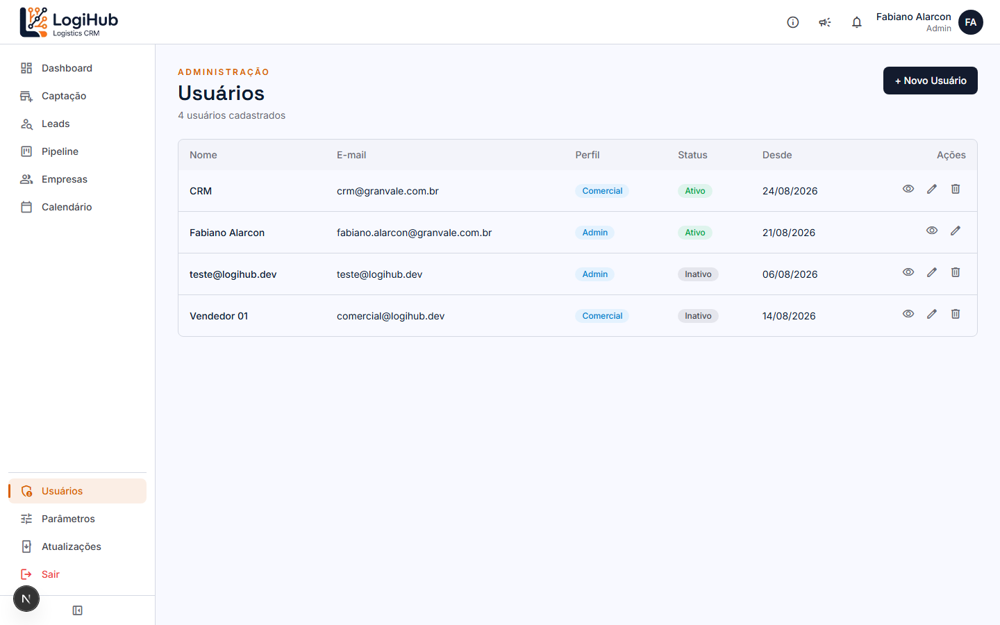
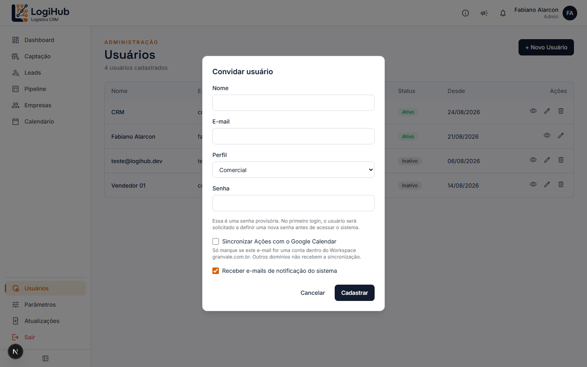
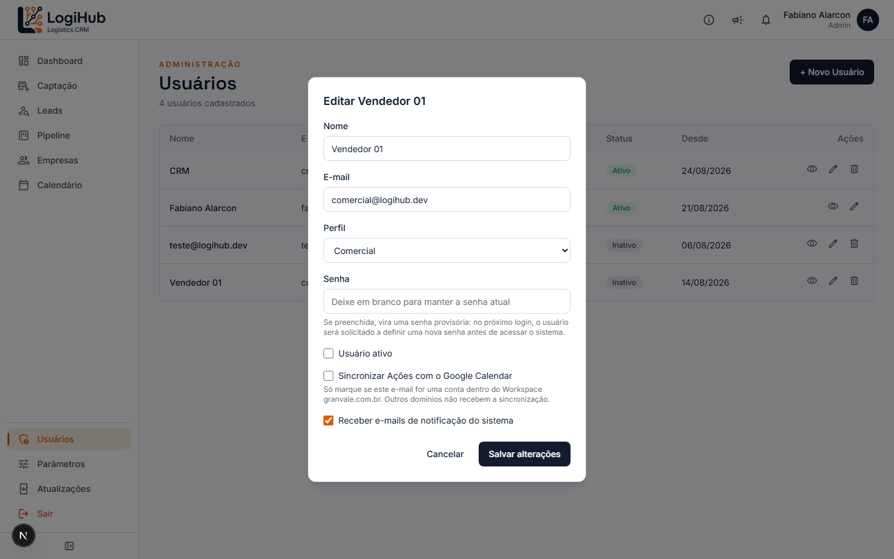

# Manual do usuário — Usuários

> Acesso: menu lateral **Usuários** (aparece só pra Admin, na seção de administração no rodapé do menu). Tela restrita a Admin.

Gestão de quem tem acesso ao sistema e com qual perfil.

## Visão geral

Cada linha mostra o perfil (**Admin** ou **Comercial**) e o status (**Ativo**/**Inativo**). Um usuário **Inativo** não consegue fazer login. Repare que a sua própria conta não mostra a opção de excluir — não dá pra se auto-excluir.

## Como convidar um novo usuário

Clique em **+ Novo Usuário**:

| Campo | Observação |
|---|---|
| Nome | |
| E-mail | Vira o login |
| Perfil | Admin ou Comercial |
| Senha | **Provisória** — no primeiro login, o próprio usuário é obrigado a trocar antes de acessar o sistema |
| Sincronizar Ações com Google Calendar | Só funciona se o e-mail for uma conta dentro do Workspace `granvale.com.br` — outros domínios não recebem a sincronização, mesmo marcado |
| Receber e-mails de notificação | Vem marcado por padrão; o próprio usuário também pode desligar depois |

Ao cadastrar, o sistema envia um e-mail de boas-vindas pro novo usuário com a senha provisória.

## Como editar um usuário

Clique no ícone de lápis (✏️) na linha:

Além dos mesmos campos do convite, aqui aparece o checkbox **Usuário ativo** — desmarcar desativa o acesso (a pessoa não consegue mais logar, mas os dados que ela criou continuam no sistema normalmente). Deixar o campo **Senha** em branco mantém a senha atual; preenchendo, vira uma nova senha provisória (o usuário vai ter que trocar no próximo login).

## Como excluir um usuário

Ícone de lixeira (🗑) na linha — indisponível pra sua própria conta. Considere **desativar** em vez de excluir se não tiver certeza, já que a exclusão remove a conta de autenticação (o perfil e o histórico de ações associadas à pessoa continuam, mas ela nunca mais poderá logar com aquele e-mail).

## Quem pode fazer o quê

Tudo nesta tela é **exclusivo de Admin** — tanto a página quanto cada ação são bloqueadas no servidor pra Comercial, não é só a tela escondida.
